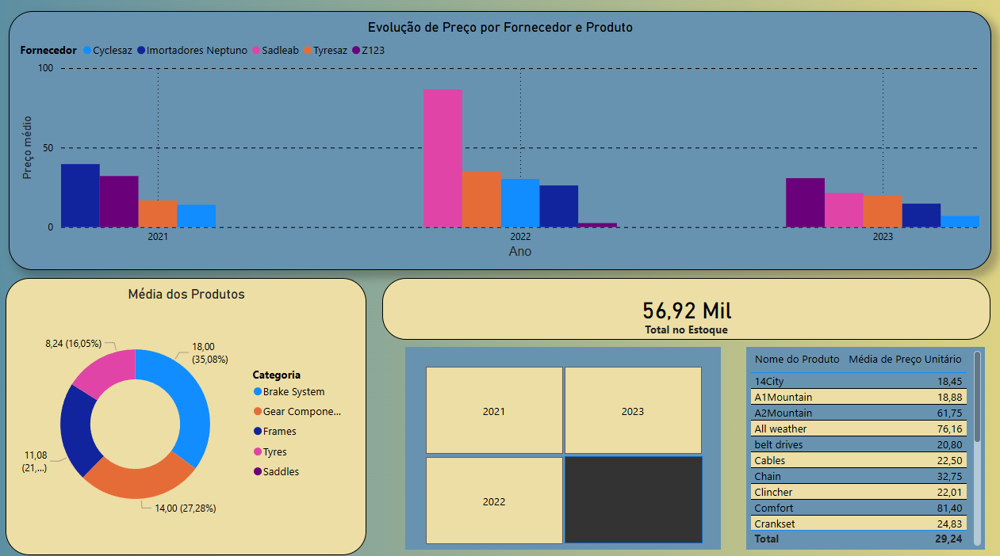
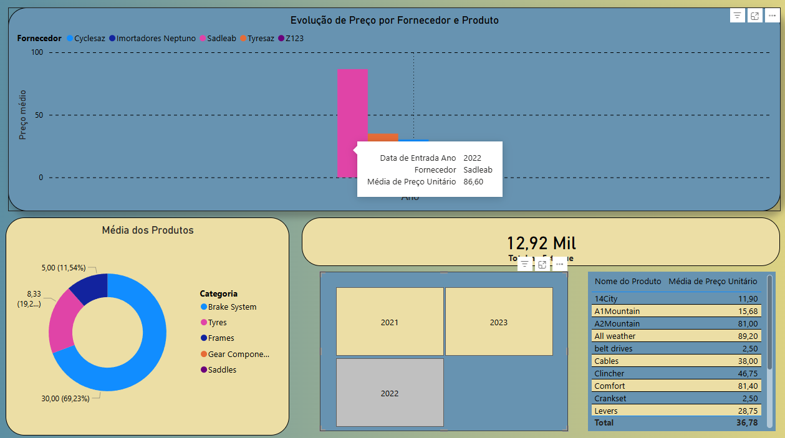
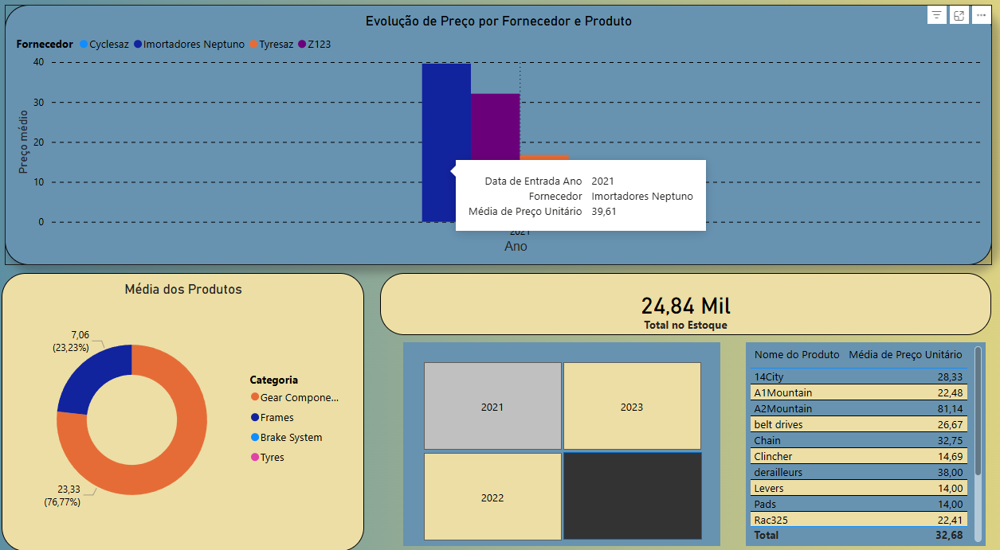
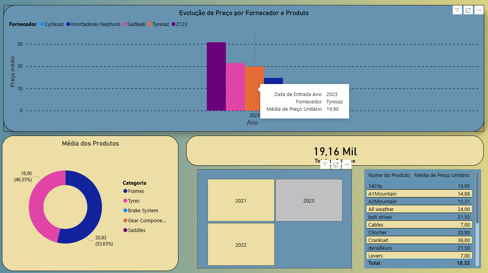

# Dashboard de Análise de Preços — Adventure Works

## Sobre o Projeto
Dashboard desenvolvido no Power BI para monitorar a evolução 
de preços dos produtos adquiridos pela Adventure Works, 
rastreando variações por fornecedor ao longo do tempo e 
identificando anomalias de preço.

## 📚 Origem
Este projeto é baseado em um estudo de caso prático do curso
**Microsoft Power BI Data Analyst** disponível na plataforma 
**Coursera**, oferecido pela Microsoft.

## Objetivo
Atender à solicitação da executiva Renee de:
- Rastrear o aumento de preços por fornecedor do passado ao presente
- Monitorar o preço unitário de cada produto por fornecedor
- Detectar situações incomuns de preços (outliers)

## Insights Encontrados
- O fornecedor **Sadleab** apresentou preço elevado em 2022
  nos produtos **Comfort** e **All Weather**, com valor de
  **R$ 123,79** — significativamente acima da média dos 
  demais fornecedores e anos, caracterizando uma anomalia
  de preço conforme solicitado pela análise.

## Fonte de Dados
- **Arquivo:** Adventure Works Inventory.xlsx
- **Planilha:** Products
- **Campos utilizados:** Data de Entrada, Nome do Produto, 
  Fornecedor e Preço Unitário

## Visualizações

## Como usar
1. Baixe o arquivo `adventure-works-dashboard.pbix`
2. Abra no Power BI Desktop (gratuito)
3. Use os filtros de Ano e Fornecedor para navegar

## Ferramentas
- Microsoft Power BI Desktop
- Microsoft Excel